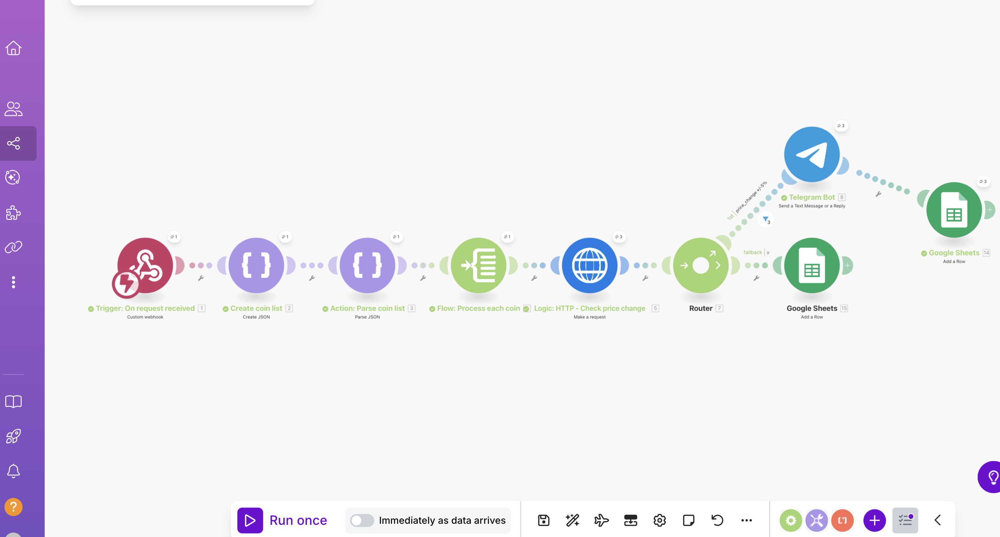
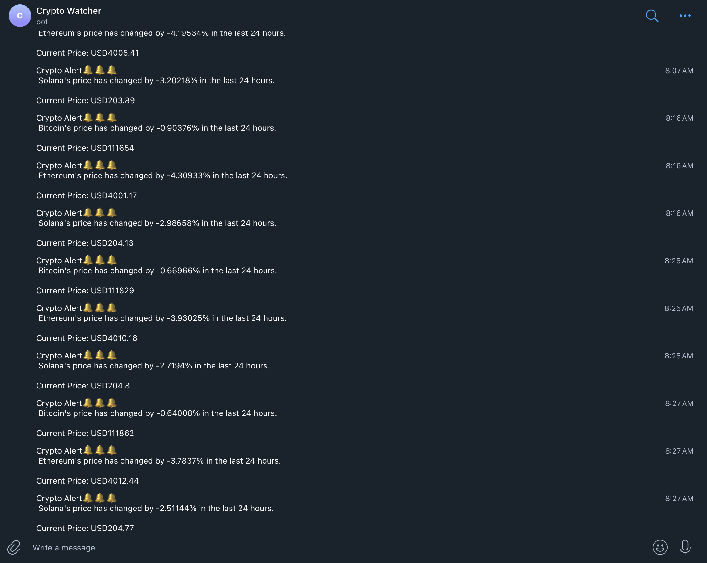
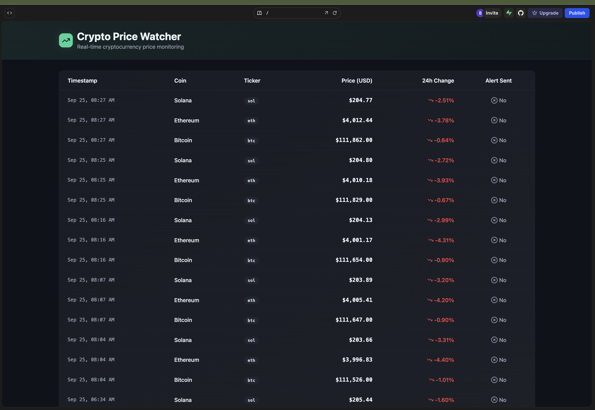

# 🚀 Crypto Watcher  

A **crypto price monitoring and alerting system** built with **Make.com** and enriched with visualisation using **Lovable UI**.  

  

---

## 🔎 Project Overview  

The cryptocurrency market is fast-moving, and traders need **timely insights** to act quickly.  
Crypto Watcher automates monitoring and alerting, ensuring that users are notified in real-time when significant market events occur.  

---

## 🎯 Objectives  

- Monitor cryptocurrency prices and key market metrics automatically.  
- Deliver actionable alerts across multiple channels.  
- Log data and visualise results in a dashboard.  

---

## ⚙️ Features  

- **Webhook Triggering** → Start monitoring via webhook or schedule.  
- **Live Data Retrieval** → Pulls crypto data from [CoinGecko API](https://www.coingecko.com/en/api).  
- **Custom Alert Logic** → Price swings, trending/newly listed coins.  
- **Notifications** → Telegram, Slack, Email, SMS.  
- **Visualisation** → Google Sheets logging & Lovable UI dashboard.  

---

## 🛠️ Tech Stack  

- **Make.com** → Workflow automation.  
- **CoinGecko API** → Market data source.  
- **Telegram / Slack / Email / SMS** → Notification channels.  
- **Google Sheets** → Trend logging.  
- **Lovable UI** → Real-time dashboard.  

---

## ✅ Implementation  

1. **Webhook Trigger** → Starts workflow.  
2. **API Call** → Retrieves enriched crypto data.  
3. **Logic Module** → Applies thresholds for alerts.  
4. **Notifier** → Sends alerts to configured channels.  
5. **Database** Data logged into Google Sheets.  
6. **Dashboard** Lovable UI displays live data.  

---

## 📷 Screenshots  

| Workflow (Make.com) | Alerts (Telegram) | Dashboard (Lovable UI) |
|---------------------|--------------------|-------------------------|
|  |  |  |  

---

## 📄 Documentation  

- [Setup Guide](docs/setup.md)  
- [Workflow Overview](docs/workflow-overview.md)  
-  

---

## 🚧 Future Enhancements  

- Additional data sources (Binance API, CoinMarketCap).  
- Technical indicators (RSI, moving averages).  
- Historical analytics dashboards.  
- Multi-user configurable alerts.  

---

## 📌 Key Learnings  

- Designed automated workflows using **Make.com**.  
- Integrated external **APIs** into automation pipelines.  
- Implemented **multi-channel notifications**.  
- Experimented with **no-code UI dashboards** for visualisation.  

---
